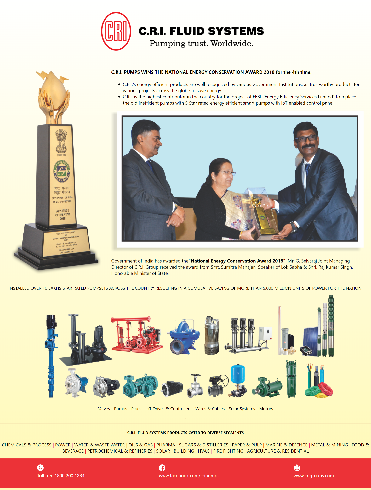

# Practice App

- [Practice App](#practice-app)
  - [Installation](#installation)
  - [Poster to convert](#poster-to-convert)
  - [Website overview that I made from this Poster](#website-overview-that-i-made-from-this-poster)
  - [Credits](#credits)

This project was made as an assignment for internship.

## Installation

- Clone repository from Github.
- In the terminal, run the command `npm install` and then run `npm start`

## Poster to convert

## Website overview that I made from this Poster

This website looks exactly same as the target poster and is completely responsive in all screen sizes.

## Credits

This website is created using [React](https://react.dev/learn). The icons are obtained as png images from [flaticon](https://www.flaticon.com/).

This website print is taken using [FireShot](https://chromewebstore.google.com/detail/take-webpage-screenshots/mcbpblocgmgfnpjjppndjkmgjaogfceg) extension