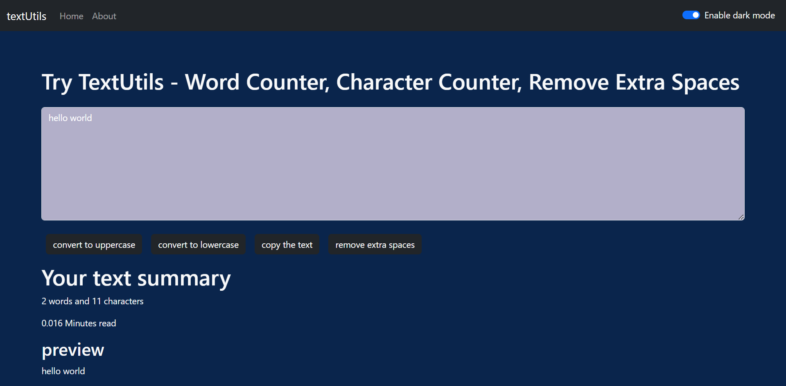

- [Text-Utils](#text-utils)
  - [Installation](#installation)
  - [Website-Overview](#website-overview)
  - [Tech Stack](#tech-stack)
  - [Credits](#credits)
# Text-Utils

TextUtils is a word counter and a character counting utility which can be used to manipulate your text in the way you want.You can remove extra spaces, copy the manipulated text as well as convert your text from Uppercase to lowercase and lowercase to uppercase

## Installation

* Clone repository from Github.
* In the terminal, run the command `npm install` and then run `npm start`

## Website-Overview

## Tech Stack

This website was made from [React.js](https://react.dev/) and [Bootstrap](https://getbootstrap.com/) for responsive designs.

## Credits

This is the first website that I made to learn React.js by following [CodeWithHarry](https://www.youtube.com/@CodeWithHarry)'s [tutorial](https://www.youtube.com/playlist?list=PLu0W_9lII9agx66oZnT6IyhcMIbUMNMdt) on youtube.

This website print is taken using [FireShot](https://chromewebstore.google.com/detail/take-webpage-screenshots/mcbpblocgmgfnpjjppndjkmgjaogfceg) extension